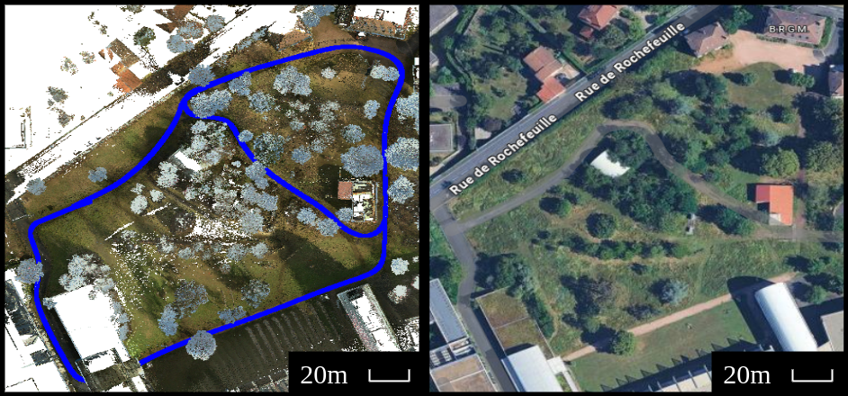

# Natural and Semi-Urban  Dataset
**Weekly Multi-Temporal Dataset for Short-Term Localization and Environmental Change Analysis**

Dataset website: <a href="https://raoufdannaoui1.github.io/Natural_and_Semi-Urban_Dataset/" target="_blank">raoufdannaoui1.github.io/Natural_and_Semi-Urban_Dataset/</a>
 


## Overview
The dataset is a short-term, high-resolution, multi-modal dataset focused on understanding how real-world changes—such as vegetation growth, trimming, and object displacement—affect 3D LiDAR-based localization in dynamic outdoor environments. The data was collected weekly from **February to April 2025**, across two contrasting outdoor scenarios:

- **Natural Environment:** INRAE Forest, Clermont-Ferrand  
- **Semi-Urban Environment:** Around Université Clermont Auvergne

This dataset provides a unique opportunity to analyze and benchmark localization robustness over short time intervals, making it ideal for applications in re-localization, change detection, SLAM, and dynamic mapping.


## Dataset Description
Each weekly session contains:

- **Two Environments:**
  - **Track 1-2 (bidirectional):** Semi-urban university campus (~850m)
  
  
  - **Track 3-4 (bidirectional):** Natural forest path (~680m)
  

- **Data Structure (per week):**
    ```plaintext
    weekXX_hhmm-DD-MM-YYYY/
    │── assets/
    │   └── track_trajectories
    │
    │── images_360/
    │   ├── SemiUrban_track1-2/
    │   └── Urban_track3-4/
    │
    └── point_clouds/
        ├── SemiUrban_track1-2/
        └── Urban_track3-4/
    ```


- **Contents:**
  - **Colorized & classified point clouds**  
    - Provided per semantic class (ground, vegetation, vehicles, etc.)  
    - ~100 million points for a Semi-Urban map and ~150 million points for a Natural map
    - Average size: ~4 GB for a Semi-Urban map and ~5.5 GB for a Natural map (LAS format files)  
  - **Panoramic images**  
    - 360° images captured every 3 meters along each track  
    - Resolution: 7040 × 3520 pixels  
    - Average size: ~2–3 MB per image (JPEG)  
    - Includes GNSS-tagged camera trajectory
  - **GNSS/IMU trajectories**  
    - Provides full pose: position (x, y, z) and orientation (quaternion: qw, qx, qy, qz)  

<div style="text-align:center">
  
</div>

## Applications
This dataset supports research in:
- Re-localization and map alignment
- Short-term environmental dynamics
- ICP evaluation (Point-to-Point, Point-to-Plane, etc.)
- Scene segmentation and change detection
- Structure-aware risk prediction in navigation


## Acquisition Platform
All data is recorded using a **Leica Pegasus TRK100** mounted on a **Zoe electric vehicle**, the Leica is equipped with:
- Two 16-beam LiDARs  
- 360° panoramic camera  
- GNSS and IMU for centimeter-level pose accuracy  

<div style="text-align:center">
 
</div>


## Data Availability
The full dataset files (point clouds, images, and trajectories) is publicly available directly on [Hugging Face](https://huggingface.co/datasets/ardannaoui/Natural_and_SemiUrban_Dataset/tree/main), or via [raoufdannaoui1.github.io/Natural_and_Semi-Urban_Dataset](https://raoufdannaoui1.github.io/Natural_and_Semi-Urban_Dataset/) for selective download.

## Citation
If you use this dataset in your research, please cite our paper.
```plaintext
 @inproceedings{ardannaoui_2025_icp_analysis,
   title={When and Where Localization Fails: An Analysis of the Iterative Closest Point in Evolving Environments},
   author={Dannaoui, Abdelraouf and Laconte, Johann and Debain, Christophe and Pomerleau, Fran{\c{c}}ois and Checchin, Paul},
   booktitle={2025 European Conference on Mobile Robots (ECMR)},
   year={2025},
   organization={IEEE},
   note={Accepted for publication}
 }
```


## Contact
For questions or collaborations, feel free to contact:

**Abdel-Raouf Dannaoui**  
Ph.D. Candidate in Robotics -- INRAE  
dannaoui.abdelraouf@gmail.com
